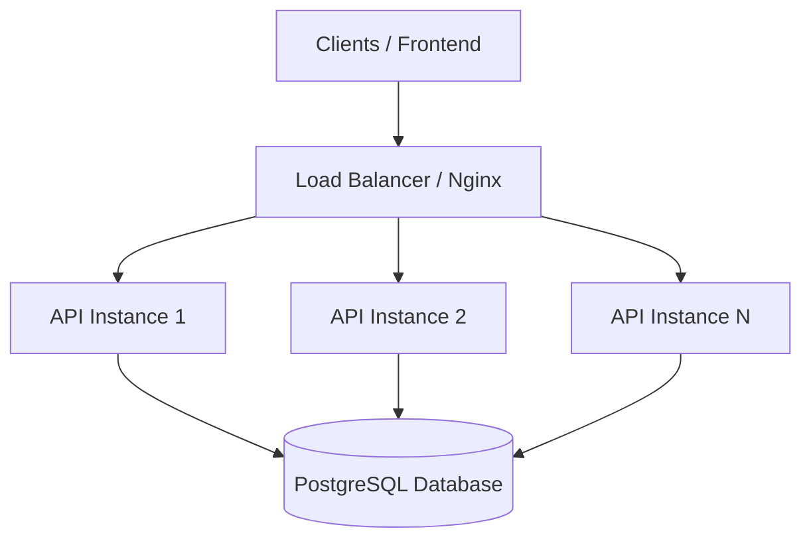
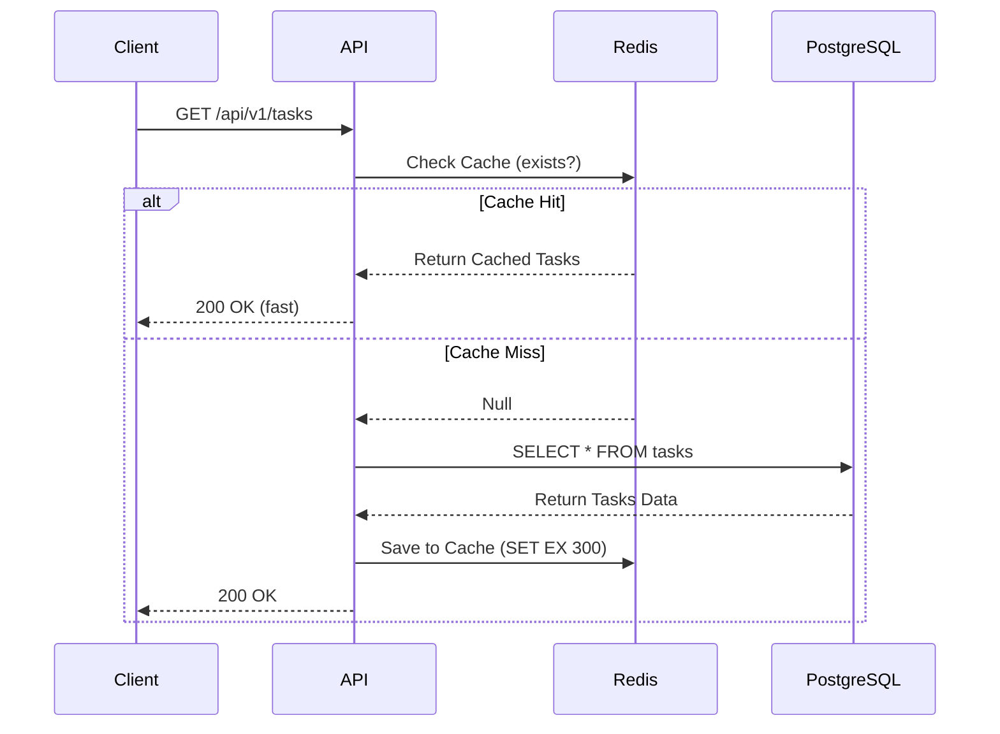
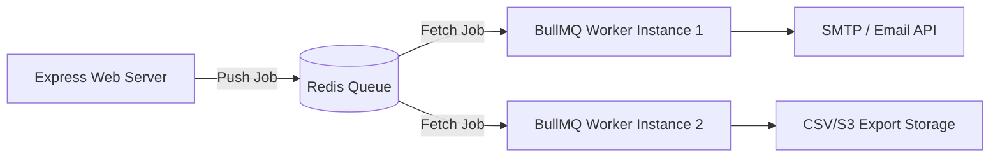

# Scalability Architecture Plan - AccessGuard

This document details the architectural roadmaps and patterns required to scale the AccessGuard REST API and database to support millions of active users and high-throughput concurrent workloads.

---

## 1. Stateless Backend & Horizontal Scaling

The AccessGuard Express API is designed to be **completely stateless**:
- **Stateless Authentication**: Session state is not stored in memory. The backend verifies incoming requests by validating the cryptographically signed JWT token.
- **Horizontal Scaling**: Since instances do not share local memory state, we can run multiple containerized copies of the backend behind a load balancer. If traffic surges, we can scale out from 2 instances to 100+ instances using Kubernetes (EKS/GKE) or AWS ECS with Autoscaling Policies based on CPU/Memory thresholds.

---

## 2. Load Balancing

To distribute client requests uniformly across scaled backend instances:
- **Load Balancer (e.g., NGINX, HAProxy, AWS ALB)**: Sits in front of our application instances, acting as the single entry point.
- **Routing Algorithms**: Use *Round Robin* or *Least Connections* depending on request weight.
- **SSL Termination**: Offload HTTPS decryption to the load balancer, freeing up resources on node containers to focus exclusively on executing application business logic.

---

## 3. Caching Layer with Redis

A high-performance caching layer prevents database performance degradation by serving repetitive read requests:
- **Cache-Aside Pattern**: When retrieving tasks or profile metadata, the API first queries Redis. On a cache miss, it retrieves the record from PostgreSQL, saves a copy in Redis with a short Time-To-Live (TTL, e.g., 5-15 mins), and returns it to the client.
- **Database Write Invalidation**: When a task is updated or deleted, the backend invalidates the corresponding Redis cache key to prevent serving stale data.
- **Rate Limiting**: Use Redis to store request counters per IP/user ID, implementing sliding-window rate limiting to prevent DDoS attacks and API abuse.

---

## 4. Database Scaling & Optimization

As read/write loads increase, the database typically becomes the primary bottleneck:
- **Database Connection Pooling**: PostgreSQL forks a backend process for every connection, which is resource-intensive. Using **PgBouncer** or Prisma's built-in connection pooler limits connection overhead.
- **Read/Write Replication**: 
  - Direct all write operations (`INSERT`, `UPDATE`, `DELETE`) to a Primary master instance.
  - Set up multiple Read Replicas (synchronized asynchronously) to serve read queries (`GET` requests), distributing the read workload.
- **Database Indexing**: Build indexes on query criteria. In AccessGuard, we index `userId` on the `tasks` table, minimizing query lookups from $O(N)$ linear scans to $O(\log N)$ binary tree searches.
- **Data Partitioning**: Partition the `tasks` table by time ranges (e.g., monthly) or partition user data by region (sharding) when table row counts exceed tens of millions.

---

## 5. Microservices Decision Logic

As the team and traffic grow, splitting the monolithic AccessGuard backend into isolated microservices prevents development bottlenecks.

### Split Criteria (When to partition)
1.  **Independent Scaling Profiles**: The `Auth` service is CPU-intensive (cryptographic hashing & signatures) but transactionally light. The `Tasks` service is database I/O-intensive. The `Notifications` service runs bursty workloads during peak alert windows.
2.  **Domain Autonomy**: When separate product teams manage different domains (e.g., identity team vs. productivity tools team), microservices prevent code conflicts.
3.  **Blast Radius Reduction**: A failure in task processing should not prevent users from logging in or registering.

### Communication Design
*   **Synchronous (HTTP/gRPC)**: Used strictly for real-time validation checks. For instance, when the `Tasks` service needs to verify a user's role, it makes a high-throughput, low-latency gRPC request to the `Auth` service.
*   **Asynchronous (Message Broker/Event-Driven)**: Used for task modifications, updates, and downstream events. For instance, when a task status transitions to `COMPLETED`, the `Tasks` service publishes a `task.completed` event to **RabbitMQ** or **Apache Kafka**. The `Notification` service consumes this event and emails the manager, avoiding blocking operations for the client.

---

## 6. Observability & Auto-Scaling

A highly available application requires instrumentation to proactively monitor system health and scale resources.

### Metrics Collection & Dashboards
*   **Prometheus & Grafana**: Export container-level metrics (CPU, Memory, Event Loop Lag, HTTP Request Duration Percentiles) from Express using `prom-client`. Grafana visualizes these metrics to track latency spikes (p95, p99) and active database connections.
*   **Structured Logging**: Replace standard string logs with JSON-formatted logs containing metadata (correlation IDs, service names, response status codes, timestamps) using **Winston** or **Pino**. Logs are aggregated in centralized sinks like Elasticsearch or Grafana Loki.

### Kubernetes Horizontal Pod Autoscaler (HPA)
*   Deploy containers in a Kubernetes cluster (GKE/EKS) configured with a Horizontal Pod Autoscaler (HPA).
*   Set target utilization scaling rules (e.g., scale pods if average CPU utilization exceeds 70% or average RAM exceeds 75%).
*   **Cooldown & Scale-Down**: Configure a cool-down window (e.g., 5 minutes) to prevent cluster thrashing during bursty network traffic.

---

## 7. Asynchronous Processing

To prevent blocking client request threads with long-running operations:

### Queue Architecture (BullMQ + Redis)
*   **BullMQ** operates on top of Redis to handle message queuing, job delays, retries, and job status tracking.
*   **Workers**: Background worker processes run on dedicated containers separate from the web servers, reading jobs from Redis queues.

### Typical Workloads
1.  **Email Verification / Reset Passwords**: Sending an email via SMTP takes 1–3 seconds. Instead of making the user wait, Express queues a `send-email` job and returns a `202 Accepted` status immediately.
2.  **CSV/PDF Task Exports**: Gathering and building files from thousands of task rows is database-heavy. The client requests an export, the worker generates the report asynchronously, uploads it to S3, and sends a secure download link via email or WebSockets.

---

## 8. Cost-Phased Scaling

Scalability must align with project budgets. We implement a three-phase infrastructure expansion roadmap:

### Phase 1: Small/MVP (Single Server + Shared DB)
*   **Design**: Run containerized frontend and backend services on a single VM (e.g., AWS EC2, GCP Compute Engine) or managed service (Vercel, Render) with a single Postgres database instance.
*   **Costs**: Low ($10 - $50/month).
*   **Bottlenecks**: Single point of failure (SPOF) on the server and database.

### Phase 2: Growing/Scale-out (Compute Pools + Read Replicas)
*   **Design**: 
    *   Deploy backend instances to a container cluster (ECS, GKE) behind an ALB.
    *   Separate the database to a managed DB instance (AWS RDS, GCP Cloud SQL) with one **Read Replica** to split read/write traffic.
    *   Add a single-node managed **Redis** instance for caching and rate-limiting.
*   **Costs**: Moderate ($150 - $600/month).
*   **Target**: Scales to support 10k - 100k concurrent active sessions.

### Phase 3: High Scale/Enterprise (Microservices + Multi-Region)
*   **Design**:
    *   Break domains into separate microservices deployed on Kubernetes with autoscaling.
    *   Transition database to multi-master or globally distributed engines (e.g., Amazon Aurora Serverless, Google Cloud Spanner) or sharded database clusters.
    *   Implement **Redis Cluster** for caching.
*   **Costs**: High ($2,000+/month).
*   **Target**: Scales to support millions of concurrent users with 99.99% service level agreements (SLAs).
