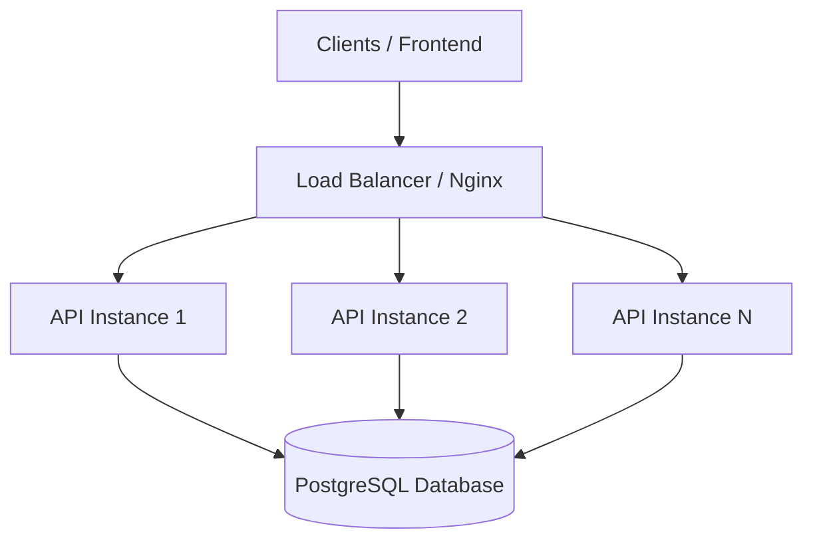
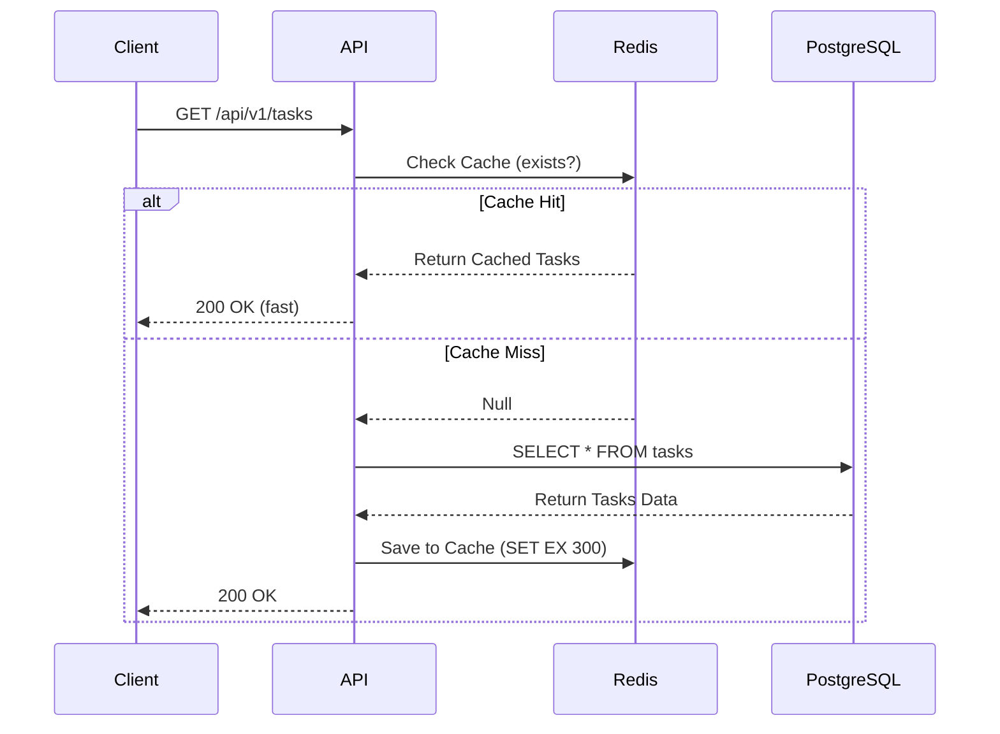

# Scalability Architecture Plan - AccessGuard

This document details the architectural roadmaps and patterns required to scale the AccessGuard REST API and database to support millions of active users and high-throughput concurrent workloads.

---

## 1. Stateless Backend & Horizontal Scaling

The AccessGuard Express API is designed to be **completely stateless**:
- **Stateless Authentication**: Session state is not stored in memory. The backend verifies incoming requests by validating the cryptographically signed JWT token.
- **Horizontal Scaling**: Since instances do not share local memory state, we can run multiple containerized copies of the backend behind a load balancer. If traffic surges, we can scale out from 2 instances to 100+ instances using Kubernetes (EKS/GKE) or AWS ECS with Autoscaling Policies based on CPU/Memory thresholds.

---

## 2. Load Balancing

To distribute client requests uniformly across scaled backend instances:
- **Load Balancer (e.g., NGINX, HAProxy, AWS ALB)**: Sits in front of our application instances, acting as the single entry point.
- **Routing Algorithms**: Use *Round Robin* or *Least Connections* depending on request weight.
- **SSL Termination**: Offload HTTPS decryption to the load balancer, freeing up resources on node containers to focus exclusively on executing application business logic.

---

## 3. Caching Layer with Redis

A high-performance caching layer prevents database performance degradation by serving repetitive read requests:
- **Cache-Aside Pattern**: When retrieving tasks or profile metadata, the API first queries Redis. On a cache miss, it retrieves the record from PostgreSQL, saves a copy in Redis with a short Time-To-Live (TTL, e.g., 5-15 mins), and returns it to the client.
- **Database Write Invalidation**: When a task is updated or deleted, the backend invalidates the corresponding Redis cache key to prevent serving stale data.
- **Rate Limiting**: Use Redis to store request counters per IP/user ID, implementing sliding-window rate limiting to prevent DDoS attacks and API abuse.

---

## 4. Database Scaling & Optimization

As read/write loads increase, the database typically becomes the primary bottleneck:
- **Database Connection Pooling**: PostgreSQL forks a backend process for every connection, which is resource-intensive. Using **PgBouncer** or Prisma's built-in connection pooler limits connection overhead.
- **Read/Write Replication**: 
  - Direct all write operations (`INSERT`, `UPDATE`, `DELETE`) to a Primary master instance.
  - Set up multiple Read Replicas (synchronized asynchronously) to serve read queries (`GET` requests), distributing the read workload.
- **Database Indexing**: Build indexes on query criteria. In AccessGuard, we index `userId` on the `tasks` table, minimizing query lookups from $O(N)$ linear scans to $O(\log N)$ binary tree searches.
- **Data Partitioning**: Partition the `tasks` table by time ranges (e.g., monthly) or partition user data by region (sharding) when table row counts exceed tens of millions.
